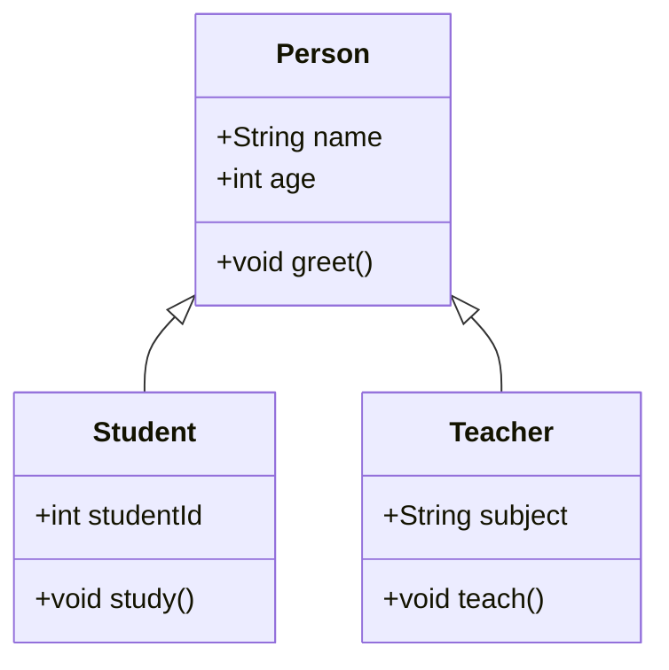

## ENSE 370 - Software System Design - Laboratory

# Lab 2: UML Refresher
### University of Regina
### Faculty of Engineering and Applied Science - Software Systems Engineering

### Lab Instructor: [Trevor Douglas](mailto:trevor.douglas@uregina.ca)

## Introduction


## Background

# Convert this to Markdown

## What is a UML Class Diagram?
A UML (Unified Modeling Language) Class Diagram is a visual representation of a system’s classes, their attributes, methods, and the relationships between the classes. It is a crucial part of object-oriented design and helps developers understand system architecture.

## Components of a UML Class Diagram

1. **Classes**: Represented as rectangles divided into three sections:
   - **Top Section**: Class name
   - **Middle Section**: Attributes
   - **Bottom Section**: Methods

   ```
   +---------------+
   | ClassName     |
   +---------------+
   | - attribute1  |
   | - attribute2  |
   +---------------+
   | + method1()   |
   | + method2()   |
   +---------------+
   ```

2. **Attributes**: Characteristics of a class, usually represented with visibility indicators:
   - `+` (public)
   - `-` (private)
   - `#` (protected)

3. **Methods**: Functions or operations that a class can perform.

## Relationships

- **Association**: A basic relationship where one class uses another. Represented by a solid line.
  
- **Inheritance**: A relationship between a superclass and a subclass. Represented by a solid line with a closed arrowhead pointing to the superclass.

- **Aggregation**: A "whole-part" relationship where the part can exist independently of the whole. Represented by a solid line with a diamond at the whole end.

- **Composition**: A stronger "whole-part" relationship where the part cannot exist independently of the whole. Represented by a solid line with a filled diamond at the whole end.

## Example UML Class Diagrams


### UML Example of Inheritance

In this example, we have a superclass called `Animal` and two subclasses, `Dog` and `Cat`. The subclasses inherit attributes and methods from the `Animal` class.

```plaintext
+---------------+
|   Animal      |
+---------------+
| - name        |
| - age         |
+---------------+
| + eat()       |
| + sleep()     | < --------------|
+---------------+                 |
       ^                          |
       |                          |
+---------------+          +---------------+
|   Dog         |          |   Cat         |
+---------------+          +---------------+
| - breed       |          | - color       |
+---------------+          +---------------+
| + bark()      |          | + meow()      |
+---------------+          +---------------+
```

### Explanation:
- **Animal**: The base class with common attributes (`name`, `age`) and methods (`eat()`, `sleep()`).
- **Dog** and **Cat**: Subclasses that extend the `Animal` class by adding specific attributes (`breed` and `color`) and methods (`bark()` and `meow()`).

### UML Example of Composition

In this example, we have a `Car` class that is composed of `Engine` and `Wheel` classes. The composition relationship indicates that the `Car` cannot exist without its `Engine` and `Wheels`.

```plaintext
+-----------------+
|      Car        |
+-----------------+
| - engine: Engine|
| - wheels: Wheel[]|
+-----------------+
| + start()       |
| + stop()        |
+-----------------+
       /_\
        |
       ◼
+-----------------+          +-----------------+
|      Engine     |          |      Wheel      |
+-----------------+          +-----------------+
| - horsepower    |          | - size          |
+-----------------+          +-----------------+
| + ignite()      |          | + rotate()      |
+-----------------+          +-----------------+
```

### Explanation:
- **Car**: The whole, which contains `Engine` and `Wheel` objects. If the `Car` is destroyed, its `Engine` and `Wheels` cannot exist independently.
- **Engine** and **Wheel**: The parts that are integral to the `Car`. They have their own attributes and methods.


```plaintext
+-----------------+          +-----------------+
|   Person        |<>------- |   Address       |
+-----------------+          +-----------------+
| - name          |          | - street        |
| - age           |          | - city          |
+-----------------+          +-----------------+
| + getName()     |          | + getFullAddress()|
| + getAge()      |          +-----------------+
+-----------------+

       ^
       |
+-----------------+
|   Employee      |
+-----------------+
| - employeeId    |
+-----------------+
| + getEmployeeId()|
+-----------------+
```


## Tools for Creating UML Diagrams
- **Lucidchart**: An online diagram tool that supports UML diagrams.
- **Draw.io**: A free online diagramming tool.
- **StarUML**: A desktop application specifically for UML modeling.

## Conclusion
UML Class Diagrams are essential for visualizing the structure of a system. By understanding classes, attributes, methods, and relationships, you can design robust object-oriented systems.


