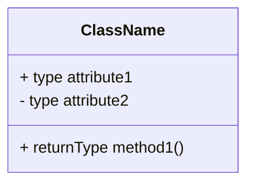
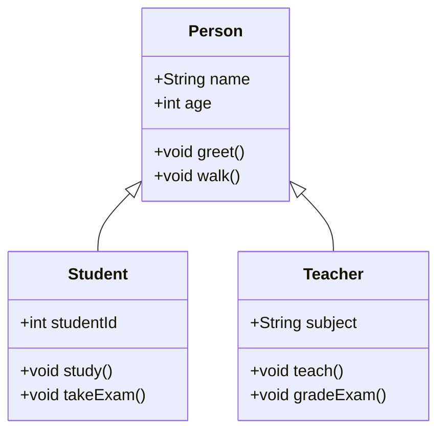
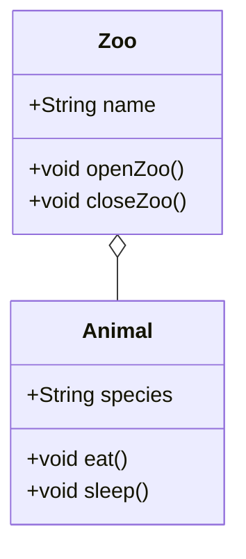
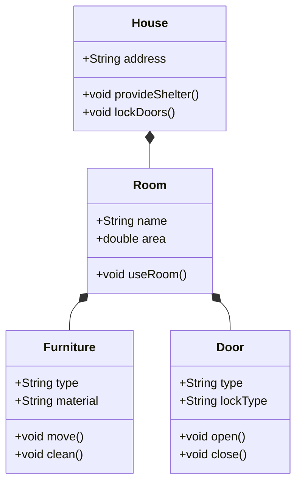
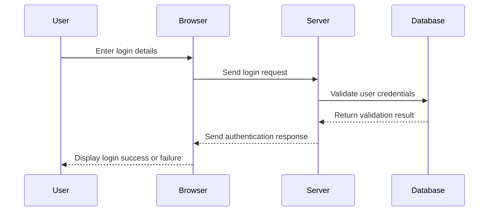
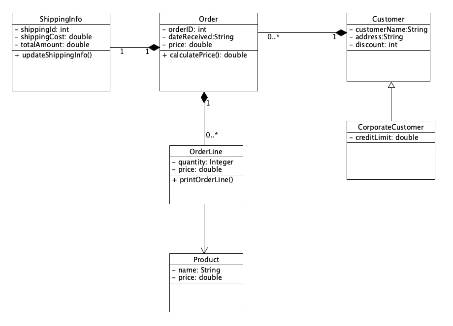
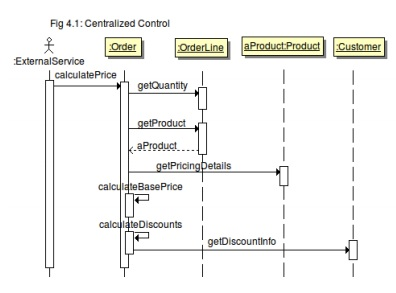

## ENSE 370 - Software System Design - Laboratory

# Lab 2: UML Refresher
### University of Regina
### Faculty of Engineering and Applied Science - Software Systems Engineering

### Lab Instructor: [Trevor Douglas](mailto:trevor.douglas@uregina.ca)

## Background

**Unified Modeling Language (UML)** is a standardized visual modeling language used to represent, design, and document the structure and behavior of software systems. It provides a way to visualize and communicate complex software designs, making it an essential tool for developers, architects, and stakeholders.

### Key Features of UML:
1. **Standardized Notation**: UML provides a common visual language that can be understood by all team members, regardless of technical expertise.
2. **Versatility**: UML is not limited to software systems—it can also be used to model business processes, organizational structures, and other complex systems.
3. **Comprehensive Modeling**: UML covers multiple aspects of system design, including structure, behavior, and interactions.

### Types of UML Diagrams:
UML is divided into two main categories of diagrams:
1. **Structural Diagrams**: Focus on the static aspects of the system.
   - **Class Diagram**: Shows the relationships between classes and their attributes and methods.
   - **Object Diagram**: Represents a snapshot of the system's objects at a particular moment.
   - **Component Diagram**: Models the physical components of a system.
   - **Deployment Diagram**: Illustrates the physical deployment of hardware and software.

2. **Behavioral Diagrams**: Focus on the dynamic aspects of the system.
   - **Use Case Diagram**: Represents the interactions between users (actors) and the system.
   - **Sequence Diagram**: Shows the flow of messages and events over time.
   - **Activity Diagram**: Models workflows or processes.
   - **State Diagram**: Describes the lifecycle of an object, including its states and transitions.

### Benefits of UML:
- **Clarity**: Simplifies the understanding of complex systems by providing clear visual representations.
- **Collaboration**: Facilitates communication among team members and stakeholders.
- **Standardization**: Adheres to industry standards, ensuring compatibility across tools and platforms.
- **Flexibility**: Can be applied to various industries and methodologies, including Agile, Waterfall, and DevOps.

## Components of a UML Class Diagram

1. **Classes**: Represented as rectangles divided into three sections:
   - **Top Section**: Class name
   - **Middle Section**: Attributes
   - **Bottom Section**: Methods

1. **Attributes**: Characteristics of a class, usually represented with visibility indicators:
   - `+` (public)
   - `-` (private)
   - `#` (protected)

2. **Methods**: Functions or operations that a class can perform.

## Relationships

- **Association**: A basic relationship where one class uses another. Represented by a solid line.
  
- **Inheritance**: A relationship between a superclass and a subclass. Represented by a solid line with a closed arrowhead pointing to the superclass.

- **Aggregation**: A "whole-part" relationship where the part can exist independently of the whole. Represented by a solid line with a diamond at the whole end.

- **Composition**: A stronger "whole-part" relationship where the part cannot exist independently of the whole. Represented by a solid line with a filled diamond at the whole end.

## Examples UML Class Diagrams

### UML Example of Inheritance

### Explanation of Methods:

#### Person:
- **greet()**: A method for the person to greet others.
- **walk()**: A method to describe a person’s ability to walk.

#### Student:
- **study()**: A method to describe studying behavior.
- **takeExam()**: A method for students to take exams.

#### Teacher:
- **teach()**: A method for teachers to teach a subject.
- **gradeExam()**: A method for grading exams.

### UML Example of Agregation

### Explanation:
- **Aggregation** is a relationship where one class is associated with another class, but the associated class can exist independently of the “whole.”
- In this example:
  - **Zoo** represents the “whole” that contains multiple animals.
  - **Animal** represents the “part,” which can exist independently outside of the Zoo (e.g., animals can live in the wild).
- The **`o--`** arrow denotes aggregation in UML.

#### Attributes and Methods:
- **Zoo**:
  - `name`: The name of the zoo.
  - `openZoo()`: A method to open the zoo for visitors.
  - `closeZoo()`: A method to close the zoo.
- **Animal**:
  - `species`: The type of animal (e.g., lion, tiger, giraffe).
  - `eat()`: A method for animals to eat.
  - `sleep()`: A method for animals to rest.

### UML Example of Composition

### Explanation:
- **Composition** is a "whole-part" relationship where the lifetime of the "parts" is entirely dependent on the "whole."
- In this example:
  - **House** is the "whole," which contains multiple `Room` objects.
  - Each **Room** is composed of multiple smaller parts: `Furniture`, `Wall`, and `Door`. These parts exist only as part of the room, and the room exists only as part of the house.

### Attributes and Methods:
#### **House**:
- `address`: The address of the house.
- `provideShelter()`: A method to describe the function of the house.
- `lockDoors()`: A method to lock all doors in the house.

#### **Room**:
- `name`: The name of the room (e.g., bedroom, kitchen, living room).
- `area`: The area of the room in square meters.
- `useRoom()`: A method to describe how the room is used.

#### **Furniture**:
- `type`: The type of furniture (e.g., chair, bed, table).
- `material`: The material of the furniture (e.g., wood, metal).
- `move()`: A method to move the furniture.
- `clean()`: A method to clean the furniture.

#### **Door**:
- `type`: The type of door (e.g., sliding, hinged).
- `lockType`: The type of lock on the door (e.g., deadbolt, latch).
- `open()`: A method to open the door.
- `close()`: A method to close the door.

### Key Points:
- **House** contains **Room**, and if the `House` is destroyed, all `Room` instances are also destroyed.
- Each **Room** is tightly bound to its parts (`Furniture`, and `Door`), meaning their lifetimes depend on the existence of the `Room`.
- The **`*--`** arrow denotes the composition relationships throughout the diagram.

## Examples UML Sequence Diagram

### Explanation:
- **Sequence diagrams** represent how objects or participants interact with each other in a specific sequence of time.

### Participants:
- **User**: Represents the person interacting with the system.
- **Browser**: Represents the user’s interface (e.g., a web browser).
- **Server**: Represents the backend system handling the logic.
- **Database**: Represents the data storage system.

### Arrows:
- **`->>`**: Represents a message or request sent from one participant to another.
- **`-->>`**: Represents a response or return message.

### Use Case:
1. The user enters login credentials (username and password) into the browser.
2. The browser sends the login request to the server.
3. The server interacts with the database to validate the user’s credentials.
4. The database sends the validation result back to the server.
5. The server responds to the browser with the authentication result.
6. The browser displays the login success or failure message to the user.

This diagram captures the flow of events in a typical user authentication process.

## Tools for Creating UML Diagrams
- **Lucidchart**: An online diagram tool that supports UML diagrams.
- **Draw.io**: A free online diagramming tool.
- **StarUML**: A desktop application specifically for UML modeling.
- **UMLet**: A free diagramming tool.

## Conclusion:
UML is a powerful tool for modeling and designing systems, bridging the gap between technical teams and stakeholders. By providing a clear, standardized way to visualize software and systems, UML enhances communication, simplifies complex concepts, and supports the successful development of robust and efficient solutions.

## Procedure

I have taken and adapted two diagrams from chapters 3 and 4 of *UML Distilled, 3rd ed.* by Martin Fowler. Your first task is to use the class diagram to produce corresponding code, sufficient that you can execute the system and see it working in skeletal form. 

<table>
  <tr>
    <td> </td>
  </tr>
</table>

Next, examine the sequence diagram, and modify your existing code to implement the centralized control scenario shown. Again, get the code executing in skeletal form but you should be able to perform what is depicted by the sequence diagram.

<table>
  <tr>
    <td> </td>
  </tr>
</table>

During this process, you may find that some modification and/or clarification of some of these classes may be necessary. In that case, you must update the class and sequence diagrams to reflect those changes. I will accept hand-drawn UML diagrams, or you may use a drawing tool like Violet, UMLet, or ArgoUML, etc.

## 2 Deliverables
- Submit your code and UML documentation to Snoopy.
