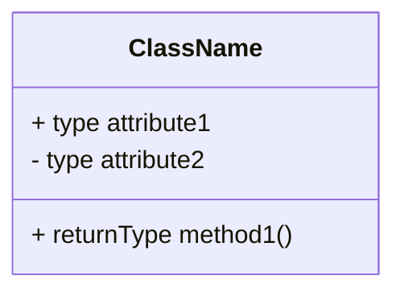
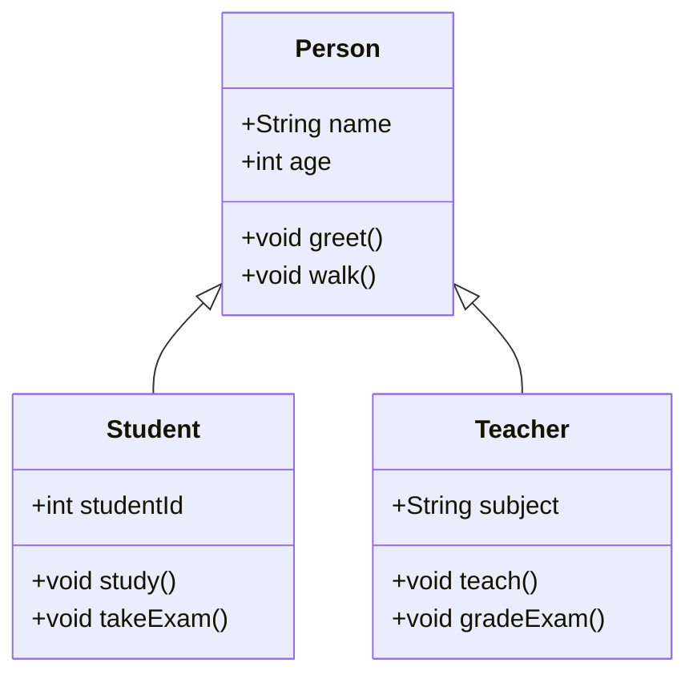

## ENSE 370 - Software System Design - Laboratory

# Lab 2: UML Refresher
### University of Regina
### Faculty of Engineering and Applied Science - Software Systems Engineering

### Lab Instructor: [Trevor Douglas](mailto:trevor.douglas@uregina.ca)

## Introduction

## Background

# Convert this to Markdown

## What is a UML Class Diagram?
A UML (Unified Modeling Language) Class Diagram is a visual representation of a system’s classes, their attributes, methods, and the relationships between the classes. It is a crucial part of object-oriented design and helps developers understand system architecture.

## Components of a UML Class Diagram

1. **Classes**: Represented as rectangles divided into three sections:
   - **Top Section**: Class name
   - **Middle Section**: Attributes
   - **Bottom Section**: Methods

1. **Attributes**: Characteristics of a class, usually represented with visibility indicators:
   - `+` (public)
   - `-` (private)
   - `#` (protected)

2. **Methods**: Functions or operations that a class can perform.

## Relationships

- **Association**: A basic relationship where one class uses another. Represented by a solid line.
  
- **Inheritance**: A relationship between a superclass and a subclass. Represented by a solid line with a closed arrowhead pointing to the superclass.

- **Aggregation**: A "whole-part" relationship where the part can exist independently of the whole. Represented by a solid line with a diamond at the whole end.

- **Composition**: A stronger "whole-part" relationship where the part cannot exist independently of the whole. Represented by a solid line with a filled diamond at the whole end.

## Examples UML Class Diagrams

### UML Example of Inheritance

### Explanation of Methods:

#### Person:
- **greet()**: A method for the person to greet others.
- **walk()**: A method to describe a person’s ability to walk.

#### Student:
- **study()**: A method to describe studying behavior.
- **takeExam()**: A method for students to take exams.

#### Teacher:
- **teach()**: A method for teachers to teach a subject.
- **gradeExam()**: A method for grading exams.

## Tools for Creating UML Diagrams
- **Lucidchart**: An online diagram tool that supports UML diagrams.
- **Draw.io**: A free online diagramming tool.
- **StarUML**: A desktop application specifically for UML modeling.

## Conclusion
UML Class Diagrams are essential for visualizing the structure of a system. By understanding classes, attributes, methods, and relationships, you can design robust object-oriented systems.

