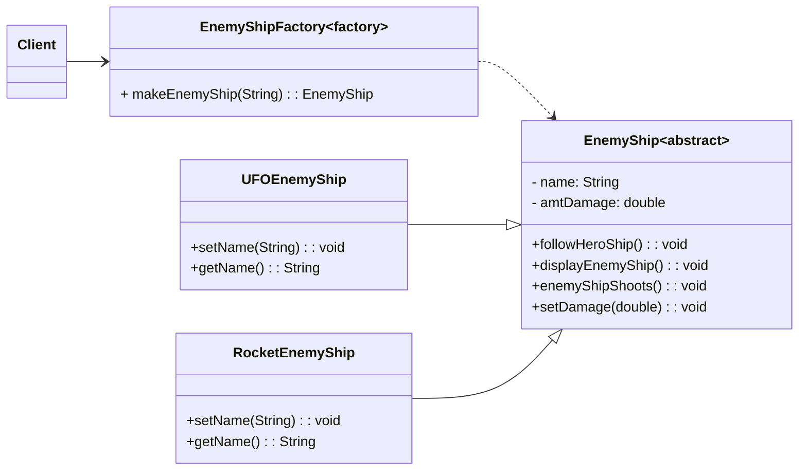

## ENSE 370 - Software System Design - Laboratory

# Lab 3: Factory Design Pattern
### University of Regina
### Faculty of Engineering and Applied Science - Software Systems Engineering

### Lab Instructor: [Trevor Douglas](mailto:trevor.douglas@uregina.ca)

## Background
 
The **Factory Design Pattern** is a **creational design pattern** that provides an interface for creating objects in a superclass but allows subclasses to alter the type of objects that will be created. It helps promote loose coupling and enhances code maintainability.

## When to Use the Factory Pattern
- When the exact type of object to be created is determined by runtime logic.
- When object creation is complex or involves multiple steps.
- When a class should not be responsible for instantiating its objects directly.
- When creating multiple related objects with slight variations.

## Structure of the Factory Pattern
The Factory Pattern typically consists of the following components:
1. **Product (Interface/Abstract Class)** - Defines the interface of objects created by the factory.
2. **Concrete Product** - Implements the product interface.
3. **Factory Class** - Contains a method to create objects based on input conditions.
4. **Client** - Calls the factory method instead of directly instantiating objects.

### Let's take an example of making an armada for UFO ships to invade Earth
<details>

<summary>expand an Abstract EnemyShip.java</summary>

in `EnemyShip.java`

```java
abstract class EnemyShip {
    protected String name;
    protected double amtDamage;

    public void followHeroShip() {
        System.out.println(name + " is following the hero ship.");
    }

    public void displayEnemyShip() {
        System.out.println(name + " is on the screen.");
    }

    public void enemyShipShoots() {
        System.out.println(name + " attacks and does " + amtDamage + " damage.");
    }

    public void setDamage(double damage) {
        this.amtDamage = damage;
    }
}

```

</details>

#### Now create some ships!
<details>

<summary>expand a Concrete UFOEnemyShip</summary>

in `UFOEnemyShip`

```java
class UFOEnemyShip extends EnemyShip {
    public UFOEnemyShip() {
        name = "UFO Enemy Ship";
        amtDamage = 20.0;
    }

    public void setName(String name) {
        this.name = name;
    }

    public String getName() {
        return name;
    }
}
```

</details>

<details>

<summary>expand a Concrete RocketEnemyShip</summary>

in `RocketEnemyShip`

```java
class RocketEnemyShip extends EnemyShip {
    public RocketEnemyShip() {
        name = "Rocket Enemy Ship";
        amtDamage = 30.0;
    }

    public void setName(String name) {
        this.name = name;
    }

    public String getName() {
        return name;
    }
}

```

</details>

#### Let us test our armada

<details>

<summary>Test the Armada</summary>

in `EnemyShipTesting`

```java
public class EnemyShipTesting {
    
    public static void main(String[] args){

        EnemyShip ufoShip = new UFOEnemyShip();
        doStuffToEnemy(ufoShip);


        EnemyShip rocketShip = new RocketEnemyShip();
        doStuffToEnemy(rocketShip);


    }

    public static void doStuffToEnemy(EnemyShip anEnemyShip){

        anEnemyShip.displayEnemyShip();
        anEnemyShip.followHeroShip();
        anEnemyShip.enemyShipShoots();
    }

}


```
</details>


### Factory Pattern Example
Suppose we wanted to create a factory to build enemy UFO Ships?  [Reference Derek Banas](https://www.youtube.com/watch?v=ub0DXaeV6hA&t=451s)
This will allow us to create Enemy Ships at runtime and which type of ship can be determined at run time.



<details>

<summary>expand EnemyShipFactory.java</summary>

in `EnemyShipFactory.java`

```java
class EnemyShipFactory {
    
    public EnemyShip makeEnemyShip(String newShipType){

        if(newShipType.equals("U")){
            return new UFOEnemyShip();
        }

        if(newShipType.equals("R")){
            return new RocketEnemyShip();
        }
        return null;
    }
}

```

</details>

#### Let us test our armada now using the Factory

<details>

<summary>expand Test the Armada</summary>

in `EnemyShipTesting`

```java

import java.util.Scanner;

public class EnemyShipTesting {
    
    public static void main(String[] args){

        //Create the Factory object
        EnemyShipFactory shipFactory = new EnemyShipFactory();

        Scanner userInput = new Scanner(System.in);
        
        //Ask the operator which ship to create
        System.out.println("What type? U = UfO; R = Rocket");

        if (userInput.hasNextLine()){
            
            String typeOfShip = userInput.nextLine();

            EnemyShip enemyShip = shipFactory.makeEnemyShip(typeOfShip);

            if(enemyShip != null){
                doStuffToEnemy(enemyShip);
            }
        }
    }

    public static void doStuffToEnemy(EnemyShip anEnemyShip){

        anEnemyShip.displayEnemyShip();
        anEnemyShip.followHeroShip();
        anEnemyShip.enemyShipShoots();
    }
}

```
</details>


## Advantages of Factory Pattern
- **Encapsulation of Object Creation**: The creation logic is moved to the factory, reducing dependencies in the client code.
- **Code Maintainability**: New product types can be added without modifying existing client code.
- **Improved Scalability**: Easy to extend by adding new product types without modifying factory logic significantly.
- **Loose Coupling**: The client code depends on abstractions rather than specific implementations.

## Disadvantages
- **Increased Complexity**: Additional classes and interfaces may increase complexity.
- **Limited to a Single Factory Class**: In some cases, having a single factory class might become a bottleneck.

## Conclusion
The **Factory Design Pattern** is a powerful creational pattern that enhances modularity, scalability, and flexibility in software design. It is widely used in frameworks and libraries where object creation needs to be abstracted and controlled. By using factories, you can decouple the client code from the object creation process, making your application easier to maintain and extend.

# ENSE 370 Lab  
## Factory Design Pattern  

**Author:** Trevor Douglas  
**Software Systems Lab Instructor**  
**University of Regina**  

---

## Procedure  

You have a position testing and developing code for the online game *World of Tanks*. Your recent work with the Factory Design Pattern has given you an idea on how to modify some development and testing code. Your job is to test the algorithm for receiving damage. The basic idea is that the penetration value must exceed the armor value in order to cause damage. One algorithm is posted below, but feel free to build your own. Given the code below, modify the code to make use of the Factory Design Pattern. This will allow your test code to test the damage algorithm on any type of tank that has been created (as long as the algorithm does not change). Ideally, you should be able to test an unlimited number of tanks, and your test code will not change as new tanks are created and need to be tested.

---
<details>

<summary>expand Tank.java</summary>

in `Tank`

```java
public class Tank {

    private String name;
    private String country;
    private int hitPoints;
    private int armor;
    private int shellDamage;
    protected int currentHealth;
    protected boolean destroyed = false;

    public void setName(String name){this.name = name;}
    public String getName(){return name;}

    public void setCountry(String country){this.country = country;}
    public String getCountry(){return country;}

    public void setHitPoints(int hitPoints){this.hitPoints = hitPoints;}
    public int getHitPoints(){return hitPoints;}

    public void setArmor(int armor){this.armor = armor;}
    public int getArmor(){return armor;}

    public void setShellDamage(int shellDamage){this.shellDamage = shellDamage;}
    public int getShellDamage(){return shellDamage;}

    public void setCurrentHealth(int currentHealth){ this.currentHealth = currentHealth;}
    public int getCurrentHealth(){ return currentHealth;}

    public boolean getDestroyed(){return destroyed;}
```
</details>


```java
    public void receiveHit(int damage, int penetration) {
        double shotDamage = 0.0;
        double shellPenetration = 0.0;

        if(destroyed) {
            System.out.println("I am dead..");
            return;
        }

        System.out.println("Received Hit..");
        
        // First check if the damage penetrates the armor.
        if (penetration > getArmor()) {
            shellPenetration = penetration - getArmor();
            shellPenetration = shellPenetration / 100.0;
            shotDamage = (damage * shellPenetration);

            if (shotDamage >= currentHealth) {
                currentHealth = 0;
                destroyed = true;
                System.out.println("Tank Destroyed !!!");
            } else {
                currentHealth -= shotDamage;
            }
        } else {
            System.out.println("No penetration...");
        }
    }
}
```

---

## Deliverables  
- Create a factory capable of building 5 different tanks. (Of course, this could grow.)  
- The test code (client) should request all the different tanks to be built and then tested.  
- The test code should not have to change as new tanks come online.  
- Document your design by creating a UML Class Diagram.  
- Submit your code and UML documentation via Snoopy.  

---


