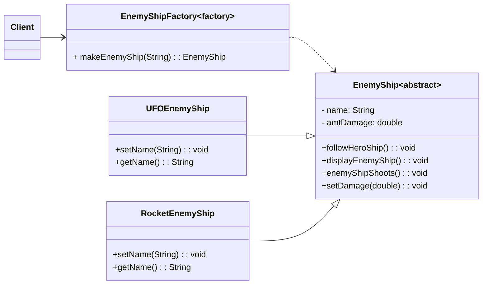

## ENSE 370 - Software System Design - Laboratory

# Lab 3: Factory Design Pattern
### University of Regina
### Faculty of Engineering and Applied Science - Software Systems Engineering

### Lab Instructor: [Trevor Douglas](mailto:trevor.douglas@uregina.ca)

## Background
 
The **Factory Design Pattern** is a **creational design pattern** that provides an interface for creating objects in a superclass but allows subclasses to alter the type of objects that will be created. It helps promote loose coupling and enhances code maintainability.

## When to Use the Factory Pattern
- When the exact type of object to be created is determined by runtime logic.
- When object creation is complex or involves multiple steps.
- When a class should not be responsible for instantiating its objects directly.
- When creating multiple related objects with slight variations.

## Structure of the Factory Pattern
The Factory Pattern typically consists of the following components:
1. **Product (Interface/Abstract Class)** - Defines the interface of objects created by the factory.
2. **Concrete Product** - Implements the product interface.
3. **Factory Class** - Contains a method to create objects based on input conditions.
4. **Client** - Calls the factory method instead of directly instantiating objects.

### Let's take an example of making an armada for UFO ships to invade Earth
<details>

<summary>expand an Abstract EnemyShip.java</summary>

in `EnemyShip.java`

```java
abstract class EnemyShip {
    protected String name;
    protected double amtDamage;

    public void followHeroShip() {
        System.out.println(name + " is following the hero ship.");
    }

    public void displayEnemyShip() {
        System.out.println(name + " is on the screen.");
    }

    public void enemyShipShoots() {
        System.out.println(name + " attacks and does " + amtDamage + " damage.");
    }

    public void setDamage(double damage) {
        this.amtDamage = damage;
    }
}

```

</details>

#### Now create some ships!
<details>

<summary>expand a Concrete UFOEnemyShip</summary>

in `UFOEnemyShip`

```java
class UFOEnemyShip extends EnemyShip {
    public UFOEnemyShip() {
        name = "UFO Enemy Ship";
        amtDamage = 20.0;
    }

    public void setName(String name) {
        this.name = name;
    }

    public String getName() {
        return name;
    }
}
```

</details>

<details>

<summary>expand a Concrete RocketEnemyShip</summary>

in `RocketEnemyShip`

```java
class RocketEnemyShip extends EnemyShip {
    public RocketEnemyShip() {
        name = "Rocket Enemy Ship";
        amtDamage = 30.0;
    }

    public void setName(String name) {
        this.name = name;
    }

    public String getName() {
        return name;
    }
}

```

</details>

#### Let us test our armada

<details>

<summary>Test the Armada</summary>

in `EnemyShipTesting`

```java
public class EnemyShipTesting {
    
    public static void main(String[] args){

        EnemyShip ufoShip = new UFOEnemyShip();
        doStuffToEnemy(ufoShip);


        EnemyShip rocketShip = new RocketEnemyShip();
        doStuffToEnemy(rocketShip);


    }

    public static void doStuffToEnemy(EnemyShip anEnemyShip){

        anEnemyShip.displayEnemyShip();
        anEnemyShip.followHeroShip();
        anEnemyShip.enemyShipShoots();
    }

}


```
</details>


### Factory Pattern Example
Suppose we wanted to create a factory to build enemy UFO Ships?  [Reference Derek Banas](https://www.youtube.com/watch?v=ub0DXaeV6hA&t=451s)




<details>

<summary>expand EnemyShip.java</summary>

in `EnemyShip.java`

```java
abstract class EnemyShip {
    protected String name;
    protected double amtDamage;

    public void followHeroShip() {
        System.out.println(name + " is following the hero ship.");
    }

    public void displayEnemyShip() {
        System.out.println(name + " is on the screen.");
    }

    public void enemyShipShoots() {
        System.out.println(name + " attacks and does " + amtDamage + " damage.");
    }

    public void setDamage(double damage) {
        this.amtDamage = damage;
    }
}

```

</details>


## Advantages of Factory Pattern
- **Encapsulation of Object Creation**: The creation logic is moved to the factory, reducing dependencies in the client code.
- **Code Maintainability**: New product types can be added without modifying existing client code.
- **Improved Scalability**: Easy to extend by adding new product types without modifying factory logic significantly.
- **Loose Coupling**: The client code depends on abstractions rather than specific implementations.

## Disadvantages
- **Increased Complexity**: Additional classes and interfaces may increase complexity.
- **Limited to a Single Factory Class**: In some cases, having a single factory class might become a bottleneck.

## Conclusion
The **Factory Design Pattern** is a powerful creational pattern that enhances modularity, scalability, and flexibility in software design. It is widely used in frameworks and libraries where object creation needs to be abstracted and controlled. By using factories, you can decouple the client code from the object creation process, making your application easier to maintain and extend.

---
Would you like a real-world example using another language like Python or JavaScript?

