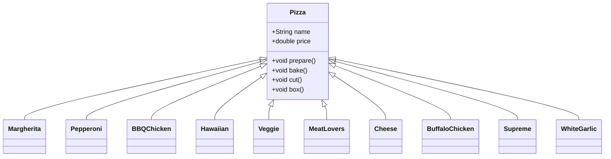
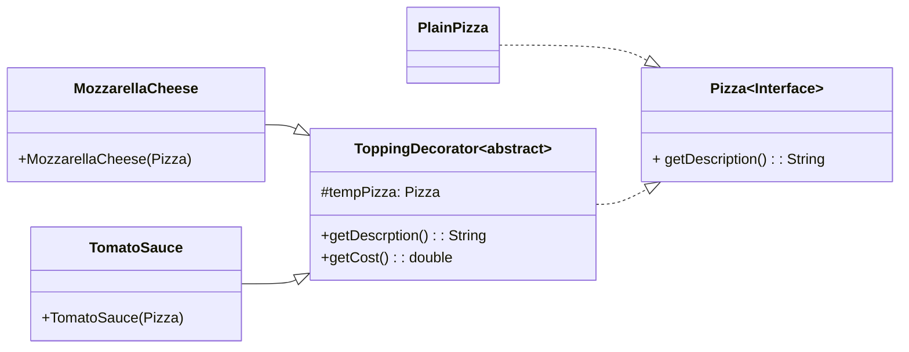

## ENSE 370 - Software System Design - Laboratory

# Lab 4: Decorator Design Pattern
### University of Regina
### Faculty of Engineering and Applied Science - Software Systems Engineering

### Lab Instructor: [Trevor Douglas](mailto:trevor.douglas@uregina.ca)

## Background
The **Decorator Pattern** is a structural design pattern that allows behavior to be added to individual objects, dynamically, without affecting the behavior of other objects from the same class. It is often used to adhere to the [**Open-Closed Principle**](./OpenClosed.md) in object-oriented design.

# Java Abstract Classes vs Interface Classes

## Interfaces
An **interface** is a reference type in Java that is similar to a class but only contains abstract methods (until Java 8, when default and static methods were introduced).

### Characteristics of Interfaces:
- Only contains method signatures (before Java 8).
- Methods are implicitly **public** and **abstract**.
- Cannot have instance variables (only static and final constants).
- Supports multiple inheritance.
- Does not have constructors.
- Can have **default methods** (from Java 8 onward).
- Can have **static methods** (from Java 8 onward).

### Example of an Interface:
```java
interface Animal {
    void makeSound(); // Abstract method
}

class Dog implements Animal {
    @Override
    public void makeSound() {
        System.out.println("Dog barks");
    }
}

public class Main {
    public static void main(String[] args) {
        Animal myDog = new Dog();
        myDog.makeSound();
    }
}
```

---

## Key Differences Between Abstract Classes and Interfaces
| Feature            | Abstract Class | Interface |
|-------------------|---------------|-----------|
| Method Types      | Can have abstract and concrete methods | Only abstract methods (until Java 8, then also default and static methods) |
| Variables        | Can have instance variables | Only `public static final` constants |
| Multiple Inheritance | Not supported | Supported |
| Constructors      | Can have constructors | Cannot have constructors |
| Access Modifiers | Supports all access modifiers | Methods are `public` by default |
| Usage            | Used when classes share common behavior | Used for defining contracts between classes |

---

## When to Use What?
- Use an **abstract class** when you need to provide base functionality for subclasses.
- Use an **interface** when you want to define a contract that multiple classes must follow.
- If a class needs to inherit behavior, use an **abstract class**.
- If a class needs to implement multiple behaviors, use **interfaces**.

---


## Decorator Design Pattern

## Key Concepts
- **Component:** The base interface or abstract class defining the methods.
- **Concrete Component:** The class that implements the base interface.
- **Decorator:** An abstract class that implements the base interface and has a reference to a component.
- **Concrete Decorators:** The classes that extend the decorator and add new behavior.


## Let's create a Pizza shop!!

<details>

<summary>expand Pizza.java</summary>

in `Pizza.java`
```java
public abstract class Pizza{


    public abstract void setDescription(String newDescription);
    public abstract String getDescription();
    public abstract void setCost(double newCost);
    public abstract double getCost();

    // I could use getter and setter methods for every 
    // potential Pizza topping
}
```
</details>

## Great!  Let's make some yummy pizza pies!

<details>
<summary>expand ThreeCheesePizza</summary>

```java
public class ThreeCheesePizza extends Pizza
{
    public  void setDescription(String newDescription)	{

    }
    
    public  String getDescription(){
        return "Mozza, Parmasen, Feta Cheese Pizza";

    }

    public  void setCost(double newCost){

    }

    public  double getCost(){
        return 10.00;
    }	
}
```
</details>

## Hmmmm  I see potential problems here
This allows us to treat all pizzas like a pizza.... this is great right?? Now we want to make other pizzas... this could get ugly.... Class Explosion!!



What if I want the price of cheese goes up.  All the other pizzas I used cheese withwill have to change their cost.

Inheritance is static while composition is dynamic in the decorator pattern.

## Let's apply the Decorator Pattern


## Write some corresponding Java code

<details>
<summary>expand Pizza.java</summary>

```java
public interface Pizza {​

	public String getDescription();​

	public double getCost();​​

}

```
</details>

<details>
<summary>expand PlainPizza.java</summary>

```java
public class PlainPizza implements Pizza{​

	public String getDescription(){
        return "Base Pizza";
    }​

	public double getCost(){
        return 4.00;
    }​​

}

```
</details>

<details>
<summary>expand ToppingDecorator.java</summary>

```Java
public abstract class ToppingDecorator implements Pizza {​

	protected Pizza tempPizza;​

	public ToppingDecorator(Pizza newPizza){​

		tempPizza = newPizza;​

	}		​

​
	public String getDescription(){​

		return tempPizza.getDescription();​

	}​

​
	public double getCost(){​

		return tempPizza.getCost();​

	}​
}
```

</details>


<details>
<summary>expand MozzarellaCheese.java</summary>

```Java
public class MozzarellaCheese extends ToppingDecorator {​

​
	public MozzarellaCheese(Pizza newPizza) {​

		//Call the super constructor and pass in the reference to the pizza
        super(newPizza); ​

	    System.out.println("Adding Mozzarella Cheese");​
	}​

	public String getDescription(){​
		return tempPizza.getDescription() + ", Mozzarella";​
	}​


	public double getCost(){​
        return tempPizza.getCost() + 2.00;​
    }​

}

```
</details>

## Now Test!!

<details>
<summary>expand TestPlainPizza.java</summary>

```Java
public class TestPlainPizza {​

  public void testMakingPizza() {​
​
    //First Make the plain pizza
    Pizza pizza = new PlainPizza();​

    //Decorate the plain pizza with Tomato Sauce
    pizza = new TomatoSauce(pizza);​

    //Decorate the plain pizza with Mozzarella Cheese
    pizza = new MozzarellaCheese(pizza);​

    //Now print out the description and cost.
    System.out.println(pizza.getDescription()​

      + " Cost =  $" + pizza.getCost());​
  }​
}​
```
</details>


## Advantages
- Promotes code reusability and flexibility.
- Follows the Open-Closed Principle.
- Can be used to add functionalities dynamically without modifying existing code.

## Disadvantages
- Can lead to complex code if multiple decorators are used.
- Debugging can be more difficult due to multiple layers.

## Conclusion
The **Decorator Pattern** is a powerful way to extend functionalities dynamically. It allows the composition of different behaviors without modifying existing code, making it an essential tool in software design.

