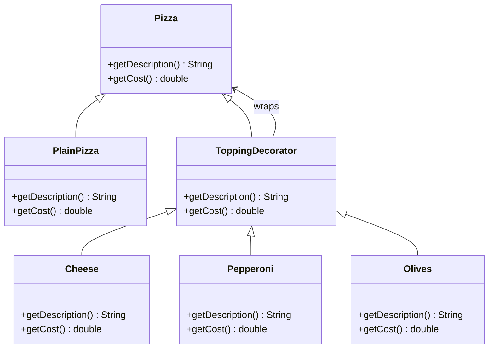

## ENSE 370 - Software System Design - Laboratory

# Lab 4: Decorator Design Pattern
### University of Regina
### Faculty of Engineering and Applied Science - Software Systems Engineering

### Lab Instructor: [Trevor Douglas](mailto:trevor.douglas@uregina.ca)

## Background
# Decorator Design Pattern Tutorial

## Introduction
The **Decorator Pattern** is a structural design pattern that allows behavior to be added to individual objects, dynamically, without affecting the behavior of other objects from the same class. It is often used to adhere to the **Open-Closed Principle** in object-oriented design.

## Key Concepts
- **Component:** The base interface or abstract class defining the methods.
- **Concrete Component:** The class that implements the base interface.
- **Decorator:** An abstract class that implements the base interface and has a reference to a component.
- **Concrete Decorators:** The classes that extend the decorator and add new behavior.


# Java Abstract Classes vs Interface Classes

## Interfaces
An **interface** is a reference type in Java that is similar to a class but only contains abstract methods (until Java 8, when default and static methods were introduced).

### Characteristics of Interfaces:
- Only contains method signatures (before Java 8).
- Methods are implicitly **public** and **abstract**.
- Cannot have instance variables (only static and final constants).
- Supports multiple inheritance.
- Does not have constructors.
- Can have **default methods** (from Java 8 onward).
- Can have **static methods** (from Java 8 onward).

### Example of an Interface:
```java
interface Animal {
    void makeSound(); // Abstract method
}

class Dog implements Animal {
    @Override
    public void makeSound() {
        System.out.println("Dog barks");
    }
}

public class Main {
    public static void main(String[] args) {
        Animal myDog = new Dog();
        myDog.makeSound();
    }
}
```

---

## Key Differences Between Abstract Classes and Interfaces
| Feature            | Abstract Class | Interface |
|-------------------|---------------|-----------|
| Method Types      | Can have abstract and concrete methods | Only abstract methods (until Java 8, then also default and static methods) |
| Variables        | Can have instance variables | Only `public static final` constants |
| Multiple Inheritance | Not supported | Supported |
| Constructors      | Can have constructors | Cannot have constructors |
| Access Modifiers | Supports all access modifiers | Methods are `public` by default |
| Usage            | Used when classes share common behavior | Used for defining contracts between classes |

---

## When to Use What?
- Use an **abstract class** when you need to provide base functionality for subclasses.
- Use an **interface** when you want to define a contract that multiple classes must follow.
- If a class needs to inherit behavior, use an **abstract class**.
- If a class needs to implement multiple behaviors, use **interfaces**.

---


### Decorator Design Pattern Example





## Advantages
- Promotes code reusability and flexibility.
- Follows the Open-Closed Principle.
- Can be used to add functionalities dynamically without modifying existing code.

## Disadvantages
- Can lead to complex code if multiple decorators are used.
- Debugging can be more difficult due to multiple layers.

## Conclusion
The **Decorator Pattern** is a powerful way to extend functionalities dynamically. It allows the composition of different behaviors without modifying existing code, making it an essential tool in software design.

