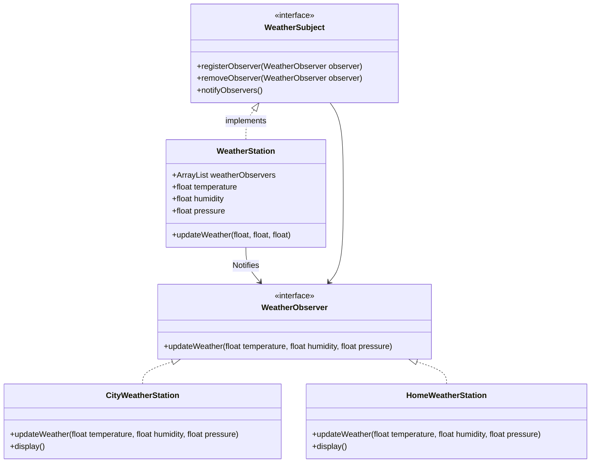

## ENSE 370 - Software System Design - Laboratory

# Lab 5: Observer Design Pattern
### University of Regina
### Faculty of Engineering and Applied Science - Software Systems Engineering

### Lab Instructor: [Trevor Douglas](mailto:trevor.douglas@uregina.ca)

## Background
# Observer Design Pattern in Java

## Introduction  
The **Observer Pattern** is a **behavioral design pattern** where an object (**Subject**) maintains a list of its dependents (**Observers**) and **notifies them** of any state changes. This promotes **loose coupling** between objects.  

### **Use Cases**  
- Implementing **publish-subscribe** mechanisms (e.g., event handling).  
- **GUI components** where multiple elements react to user actions.  
- **Stock market applications** where investors observe stock price changes.  
- **Youtube videos** where users can subscribe and be notified of new videos posted.

---

## **How the Observer Pattern Works**  
1. **Subject (Observable):** Maintains a list of observers and notifies them when a state change occurs.  
2. **Observers:** Subscribe to the subject and receive updates.  
3. **Concrete Implementations:** The subject updates all observers whenever the state changes.  

---

## **Java Implementation of Observer Pattern**  

### **Step 1: Define the WeatherSubject Interface**   

```java
// Subject interface
interface WeatherSubject {
    void registerObserver(WeatherObserver observer);
    void removeObserver(WeatherObserver observer);
    void notifyObservers();
}
```

### **Step 2: Create the WeatherStation**
This class contains the weather information that needs to be sent to the Observers.

```java
import java.util.List;
import java.util.ArrayList;

class WeatherStation implements WeatherSubject {

    ArrayList<WeatherObserver> weatherObservers;
    float temperature;
    float humidity;
    float pressure;

    public WeatherStation(){
        weatherObservers = new ArrayList<WeatherObserver>();
    }

    public void registerObserver(WeatherObserver observer){

        weatherObservers.add(observer);
    }

    public void removeObserver(WeatherObserver observer){
        weatherObservers.remove(observer);
    }

    public void notifyObservers(){
        for( WeatherObserver observers: weatherObservers){
            observers.updateWeather(temperature, humidity, pressure);
        }

    }

    public void updateWeather(float temperature, float humidity, float pressure){
        this.temperature = temperature;
        this.humidity = humidity;
        this.pressure = pressure;
        notifyObservers();
    }
}
```

### **Step 3: Create the WeatherObserver**
This class contains the weather information that needs to be sent to the Observers.

```java
interface WeatherObserver {
    public void updateWeather(float temperature, float humidity, float pressure);
}
```

### **Step 4: Create the observing customer**
This class is the concrete weather customer that wants to get updated.
```java
class CityWeatherStation implements WeatherObserver{

    float temperature;
    float humidity;
    float pressure;

    public void updateWeather(float temperature, float humidity, float pressure){
        this.temperature = temperature;
        this.humidity = humidity;
        this.pressure = pressure;
        display();

    }

    public void display(){
        System.out.println("Temperature = " + temperature);
        System.out.println("Humidity = " + humidity);
        System.out.println("Pressure = " + pressure);  
    }
}

```

### **Step 5: Test!**
```java
class TestWeather {

    public static void main(String[] args){


        WeatherStation ws = new WeatherStation();
        
        CityWeatherStation regina = new CityWeatherStation();
        ws.registerObserver(regina);
        ws.updateWeather(13, 80, 120);
        
    }
```

## Procedure
Download the sample application found in the Gamecenter folder. This application is the prototype for an NHL application. Currently, it supports 6 teams and will allow creating games for that day and updating the game scores.

Given the existing application, the objective is to adapt it to provide notifications to an interested user. The way to do this is to modify the code to use the observer design pattern.

## Deliverables
Submit your code and UML Class Diagram documentation to Snoopy.

