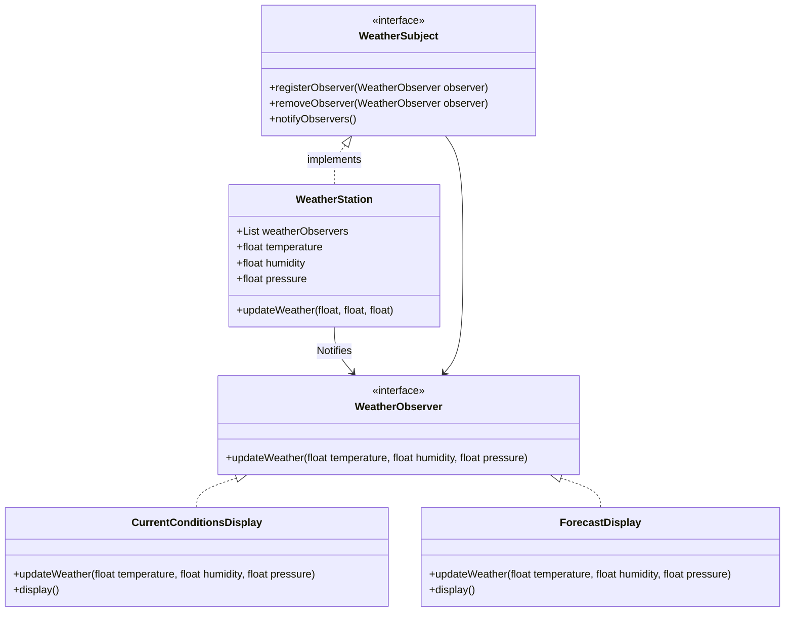

## ENSE 370 - Software System Design - Laboratory

# Lab 5: Observer Design Pattern
### University of Regina
### Faculty of Engineering and Applied Science - Software Systems Engineering

### Lab Instructor: [Trevor Douglas](mailto:trevor.douglas@uregina.ca)

## Background
# Observer Design Pattern in Java

## Introduction  
The **Observer Pattern** is a **behavioral design pattern** where an object (**Subject**) maintains a list of its dependents (**Observers**) and **notifies them** of any state changes. This promotes **loose coupling** between objects.  

### **Use Cases**  
- Implementing **publish-subscribe** mechanisms (e.g., event handling).  
- **GUI components** where multiple elements react to user actions.  
- **Stock market applications** where investors observe stock price changes.  
- **Youtube videos** where users can subscribe and be notified of new videos posted.

---

## **How the Observer Pattern Works**  
1. **Subject (Observable):** Maintains a list of observers and notifies them when a state change occurs.  
2. **Observers:** Subscribe to the subject and receive updates.  
3. **Concrete Implementations:** The subject updates all observers whenever the state changes.  

---

## **Java Implementation of Observer Pattern**  

### **Step 1: Define the WeatherSubject Interface**   

```java
// Subject interface
interface WeatherSubject {
    void registerObserver(WeatherObserver observer);
    void removeObserver(WeatherObserver observer);
    void notifyObservers();
}
```

### **Step 2: Create the WeatherStation**
This class contains the weather information that needs to be sent to the Observers.

```java
class WeatherStation implements WeatherSubject {
    List<WeatherObserver> weatherObservers;
    float temperature;
    float humidity;
    float pressure;

    public WeatherStation(){
        weatherObserver = new List<WeatherObserver>();

    }

}

```
```java
// Observer interface
interface WeatherObserver {
    void updateWeather(float temperature, float humidity, float pressure);
}
```

### **Step 2: Create the WeatherSubject Interface**
Defines methods for adding, removing, and notifying observers.

```java
import java.util.ArrayList;
import java.util.List;

```