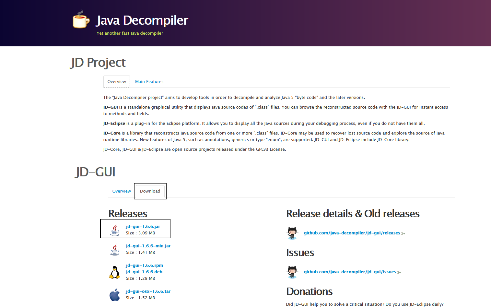
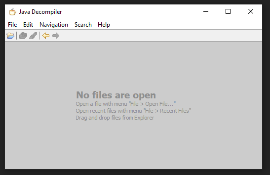
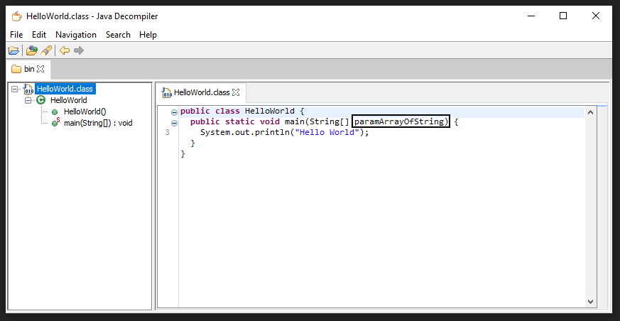
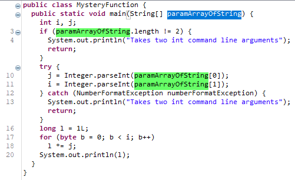

## ENSE 370 - Software Systems Design - Laboratory

# Lab 7: Reverse Engineering

### University of Regina
### Faculty of Engineering and Applied Science - Software Systems Engineering

### Lab Instructor: [Trevor Douglas](mailto:trevor.douglas@uregina.ca)
### Original author Adam Tilson

---

### Introduction

This semester we have compiled Java `.java` files into `.class` files using the `javac` application. These class files contain a header, which describe some required specifics of the class file, such as the Java version and related classes, and bytecode, which are the instructions which runs on the Java Virtual Machine. Bytecode is similar to the compiled binaries generated by C or C++ which run directly on the CPU, as you may have seen in ENSE 352. There is a human-readable representation of this code, assembly code, which is possible but very tedious for a human to understand. In generating this ByteCode, some information which is useful to programmers, such as variable names, is necessarily discarded. We may attempt to reconstruct the original source file using a Java Decompiler, such as JD, however we will not be able to automatically recover any discarded information. Additionally, we may observe other simplifications made by the compiler which makes the decompiled code more tricky to understand, even if it is functionally equivalent.

### Environment Setup

All of the source files for this lab are compiled using JDK8, as this is the latest LTS (Long-Term Support) variant of Java supported by JD. If you wish to attempt to compile and decompile your own Java files, be sure to use JDK8. You may download it from here:

[Adopt Open JDK](https://adoptopenjdk.net/)

Select JDK 8 LTS.

You may need to update your path to reflect you are using this version of Java.

If you do not plan to compile and decompile your own files, you do not need to do these steps.

We're going to use JD-GUI as our decompiler. You can download the Jar version:

[JD Gui](http://java-decompiler.github.io/)



You can run this using:

```
java -jar ./jd-gui-1.6.6.jar
```



In this application you drag and drop on compiled `.class` files and see an attempt at decompiling the code.

### Example 1: Starting Small

In the `eg-1` folder you can see our standard HelloWorld files, compiled into a `.class`. Hopefully you can now create this file blindfolded, but let's try to decompile it anyway.



Did we lose any information? Just a bit - the parameter name of the main function `args` was changed to `paramArrayOfString`. We still can figure out what this means, but this is an example of information which is discarded by recompiling code.

### Example 2: Mystery function with input and output

In the `eg-2` folder we find just one function, called MysteryClass.java. Let's try to run it first:

```
java MysteryClass
Takes two int command line arguments
```

We haven't looked at functions which take command line arguments yet. Let's try some...

```
java MysteryFunction 3 8
6561
```

Likely with enough probing we would figure out what this function does, but let's look at the decompilation instead



Note, if you double click on a variable, you will be able to see all of the places that it appears.

Lines 1...10 are some rudimentary error checking

The only tricky part of this function is...

```java
    long l = 1L;
    for (byte b = 0; b < i; b++)
      l *= j; 
    System.out.println(l);
```

Working backwards... what are i and j?

```java
    int i, j;
    ...
    try {
        j = Integer.parseInt(paramArrayOfString[0]);
        i = Integer.parseInt(paramArrayOfString[1]);
    }
```

So, i and j were the two arguments of the function. Okay...

So then, let's unpack the loop...

The `byte` datatype is a bit odd, but it's really just a small int (range `-128` to `127`) with 2's complement. This would suggest if an int was used for `i` greater than `128`, the for loop would loop infinitely . Let's try... 

```
java MysteryFunction 3 130
-9055972981221996023
```

No, it completes, but has nonsense output. Still, this seems to be an inaccuracy in the decompiled code. So be warned, some of these may happen.

Back on track, what does this function do?

Well, we have some accumulater, `l = 1`, and then for `j` iterations, multiply this value by `i`. So, if `j` is `3`, we get `i*i*i`... or `i^3`. So, it computes the power of the first argument, base, to the second argument, power. If `i` and `j` had some decent variable names, it would have been trivial to figure this one out.

### Example 3: Enc class

In this lab we are going to look at a class called `Enc` with some class functions. Let's try running it...

```
java Enc
Command line arguments: a lowercase string with spaces, and an int from 1 to 25
```

Again, we need some command line arguments.

```
java Enc "this is some text" 13
guvf vf fbzr grkg
```

Hmmm... suspicious. If you have done some other programming tasks, you may already know what's up. But let's look into the decompilation

```java
public class Enc {
  private String dec;
  
  private int key;
  
  private String enc;
  
  public static void main(String[] paramArrayOfString) {
    int i;
    if (paramArrayOfString.length != 2) {
      System.out.println("Command line arguments: a lowercase string with spaces, and an int from 1 to 25");
      return;
    } 
    try {
      i = Integer.parseInt(paramArrayOfString[1]);
    } catch (NumberFormatException numberFormatException) {
      System.out.println("Second argument must be an int");
      return;
    } 
    Enc enc = new Enc(paramArrayOfString[0], i);
    enc.encrypt();
    enc.printEnc();
  }
  
  public Enc(String paramString, int paramInt) {
    this.dec = paramString;
    this.key = paramInt;
  }
  
  public void encrypt() {
    this.enc = "";
    for (char c : this.dec.toCharArray()) {
      if (c != ' ') {
        int i = c - 97;
        int j = (i + this.key) % 26;
        c = (char)(97 + j);
      } 
      this.enc += c;
    } 
  }
  
  public void printEnc() {
    System.out.println(this.enc);
  }
}

```

So, we see that class variables, even private ones, and function names are in no way obfuscated. Nice! `enc`, `dec` and `key` may give you an idea what's happening. encrypt() suggests an encryption algorithm is running on our string, and we can run through the code to see which one, which is the Caeser cipher.

Reversingg this cipher is trivial. However, if the cipher was more complicated, we could generate and use a lookup table to figure out which input maps to which output. We could then perform reverse lookups from there.

## Example 4: Sorting with a Bug

The next one is a sorting algorithm. However, it has a bug in it. 

Let's try it out...

```
java Sort
Takes a series of ints as a command line arguments
```

By now this is familiar...

Let's try it out with some arguments...

```
java Sort 3 5 2 1 6 8 9 1 2 3 5 9
Sorted:
1 1 2 2 3 3 5 6 8 5 9 9
```

Hey, it's almost sorted. But not quite...

Let's do a decompilation and see if we can figure out what is going on...

```java
class Sort {
  static void swap(int[] paramArrayOfint, int paramInt1, int paramInt2) {
    int i = paramArrayOfint[paramInt1];
    paramArrayOfint[paramInt1] = paramArrayOfint[paramInt2];
    paramArrayOfint[paramInt2] = i;
  }
  
  static int partition(int[] paramArrayOfint, int paramInt1, int paramInt2) {
    int i = paramArrayOfint[paramInt2];
    int j = paramInt1;
    for (int k = paramInt1; k <= paramInt2 - 1; k++) {
      if (paramArrayOfint[k] < i) {
        swap(paramArrayOfint, j, k);
        j++;
      } 
    } 
    swap(paramArrayOfint, j, paramInt2);
    return j;
  }
  
  static void sort(int[] paramArrayOfint, int paramInt1, int paramInt2) {
    if (paramInt1 < paramInt2) {
      int i = partition(paramArrayOfint, paramInt1, paramInt2);
      sort(paramArrayOfint, paramInt1, i - 1);
    } 
  }
  
  public static void main(String[] paramArrayOfString) {
    int i = paramArrayOfString.length;
    if (paramArrayOfString.length == 0) {
      System.out.println("Takes a series of ints as a command line arguments");
      return;
    } 
    int[] arrayOfInt = new int[i];
    byte b;
    for (b = 0; b < i; b++) {
      try {
        arrayOfInt[b] = Integer.parseInt(paramArrayOfString[b]);
      } catch (NumberFormatException numberFormatException) {
        System.out.println("All arguments must be ints");
        return;
      } 
    } 
    sort(arrayOfInt, 0, i - 1);
    System.out.println("Sorted: ");
    for (b = 0; b < i; b++)
      System.out.print(arrayOfInt[b] + " "); 
  }
}
```

Okay, this is getting pretty tricky. All of the variable names are obfustaced. Our only hint is function names.  

Follow the function calls:

```
main calls sort -> calls partition -> call swap (multiple times)
                -> calls sort (recrusive)
```

Even if you don't understand the algorithm, hopefully the keyword `partition` communicates this is a divide-and-conquer algorithm. The most famous of which are MergeSort and QuickSort. Could this be an attempt at one of these algorithms?

There is no merge function. So, less likely to be merge sort.

If we look at the partition function, we appear to be selecting an array value using one of our parameters...
```java
int i = paramArrayOfint[paramInt2];
```

We also seem to be looping over a range directly to the left of that index, starting at our other parameter...
```java
    for (int k = paramInt1; k <= paramInt2 - 1; k++) {
        if (paramArrayOfint[k] < i) {
            swap(paramArrayOfint, j, k);
            j++;
        } 
    } 
```
If the value at the point in our loop is less than our previously checked value, we are performing a swap.

This is clearly quicksort. Knowing our algorithm, we could take a stab at renaming some of our parameters and variables...

```java
    static int partition(int[] arr, int leftBound, int rightBound) {
        int pivotValue = arr[rightBound];
        int boundary = leftBound;
        for(int i = leftBound; i <= rightBound - 1; i++) {
            if (arr[i] < pivotValue) {
                swap(arr, boundary, i);
                boundary++;
            }
        }
        swap(arr, boundary, rightBound);
        return (boundary);
    }

    static void sort(int[] arr, int leftBound, int rightBound) {
        if (leftBound < rightBound)  {
            int boundary = partition(arr, leftBound, rightBound);
            sort(arr, leftBound, boundary - 1);
        }
    }
```

Now we just need to find our bug...

Something else that is suspicious, after partitioning, the recursive sort algorithm is called only on the values to the left of the boundary:

```java
static void sort(int[] arr, int leftBound, int rightBound) {
    if (leftBound < rightBound)  {
        int boundary = partition(arr, leftBound, rightBound);
        sort(arr, leftBound, boundary - 1);
    }
}
```
This could be the cause of our bug. We want to also call it on the right side as well, so we can add the line...

```java
        sort(arr, boundary + 1, rightBound);
```

Let's try it again...

```
java Sort 3 5 2 1 6 8 9 1 2 3 5 9
Sorted:
1 1 2 2 3 3 5 5 6 8 9 9
```

Seems to be fixed. Of course, this isn't so bad with algorithms that are well known and studied. But what happens if an internal algorithm is lost, and needs to be reconstructed? This is what you will attempt in the lab assignment.


## Assignment

Imagine you are working at a company which has just been victim of a RansomWare attack, and all of the source files are now encrypted and thus inaccessible. Some of the class files, but not all, are also missing. You are tasked with re-assembling the login subsystem, the remaining files which are included in the `assn-starter` directory. Here's how you believe the system to work:

From the `Login` class (recovered), the main function is called, where users can register or login...
- When registering...
  - A `User` class (missing), is instantiated using some of the User's information
  - Using the `User`s instance, a `salt` String is generated from the `Salt` class (missing)
    - The `salt` is a deterministic String generated from some combination of information accessible from the `User` class
    - Assume that the `salt` class only has access to the `User` fields, as well as the `CharSort` function, and String concatenate operation 
    - The `Salt` class accesses the `CharSort` class, so this is going to be used as part of the solution
- Together, the password and `salt` is then hashed using the `Hash` class (recovered).
- This salted and hashed password is then used to authenticate the user
  - The general idea:
  - ` hash (password, salt) => [1254, 5254, 8523, 12548, ...]`
  - By definition, hash functions should be one-way, meaning the input cannot be reverse-engineered from the output. 
    - However, this function was intended to be breakable.
    - For example, each input character must map to exactly one output character, and vice versa
- A `LoginTest` class (recovered) exists to create and test the login class

Your task:
1. Reconstruct the User class
2. Reconstruct the Salt class, reverse engineering the missing algorithm
3. Ensure the Test classes still work
   
Approaches and hints:
- In the current state, running the application will not work due to missing class files which you must reconstruct.
- You could try to work forward, eg. start at the entry points (Login, LoginTest) and trace function calls and data types.
- You could also try to work backward, eg. look at the expected outputs and see how they are created.
- You can also try to do both - work forward until you get stuck, and then work backward, until you meet at a solution.
- You will know the system is recovered if the existing Test Cases pass
- It's safe to assume that all of the algorithms provided have some fundamental flaws, making them possible to reverse engineer for learning purposes, and really soulnd't be considered secure enough for real world usage!
  

## Testing

After filling in and fixing the existing application, compile your code like so:

In the assn-start folder you can build your code and test cases.
javac -d bin -cp "junit-platform-console-standalone-1.7.0-all.jar" LoginTest.java

this will build your code and put your test class file in a bin directory.

Now you can run your tests :

java -jar junit-platform-console-standalone-1.7.0-all.jar -cp bin --scan-class-path

Then your tests will run.  If your solution is correct all tests will pass.

---

## Submission

Please submit all of the reverse engineered / reconstructed Java files. Your project directory should include:
- CharSort.java
- Hash.java
- Input.java
- Login.java
- LoginTest.java
- Salt.java
- User.java

You should not change the functionality of any of the recovered files, eg. the .java files generated from: 

- CharSort.class
- Hash.class
- Input.class
- Login.class
- LoginTest.class

However, you can (and probably should) rename the automatically generated variable names, and add any functions you need to help you understand what's going on.
